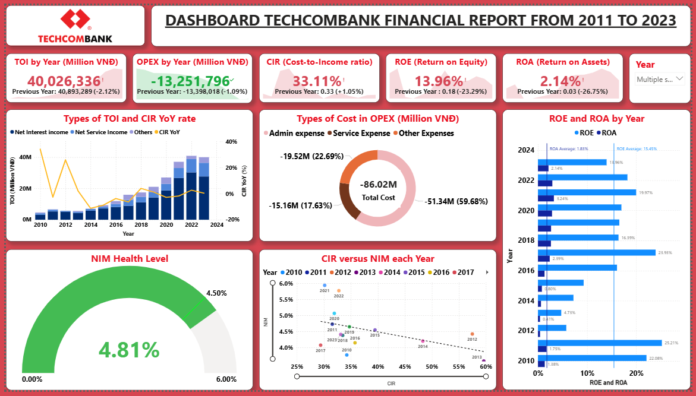

# 📊 Techcombank Financial Report Dashboard (2011–2023)

A Power BI dashboard analyzing **Techcombank's financial performance** over 13 years, built as a midterm project for FAECIU23040.

---

## 📌 Key Metrics Tracked

| Metric | Description |
|---|---|
| **TOI** | Total Operating Income by Year |
| **OPEX** | Operating Expenses by Year |
| **CIR** | Cost-to-Income Ratio |
| **ROE** | Return on Equity |
| **ROA** | Return on Assets |
| **NIM** | Net Interest Margin Health Level |

---

## 📈 Visuals Included

- **TOI and CIR YoY Rate** — Combo bar + line chart showing income growth and cost efficiency trends
- **Types of Cost in OPEX** — Donut chart breaking down Admin, Service, and Other expenses
- **ROE and ROA by Year** — Horizontal bar chart comparing profitability ratios from 2010–2023
- **NIM Health Level** — Gauge chart showing current Net Interest Margin at **4.81%**
- **CIR vs NIM Scatter Plot** — Year-by-year comparison of cost efficiency vs interest margin

---

## 🔍 Key Insights

- TOI reached **40,026,336 Million VNĐ** in the latest year, a slight decrease of 2.12% from the prior year
- OPEX improved by **-1.09%**, showing cost control efforts
- CIR stands at **33.11%**, indicating strong cost efficiency
- ROE peaked at **23.93%** in 2018, with recent figures at **13.96%**
- NIM of **4.81%** is in the healthy range (0–6%)

---

## 🛠️ Tools Used

- **Power BI Desktop**
- **Data Source:** Techcombank public financial reports (2011–2023)

---

## 📁 Files

| File | Description |
|---|---|
| `Techcombank_Financial_Dashboard.pbix` | Power BI project file |
| `dashboard.png` | Dashboard screenshot |
